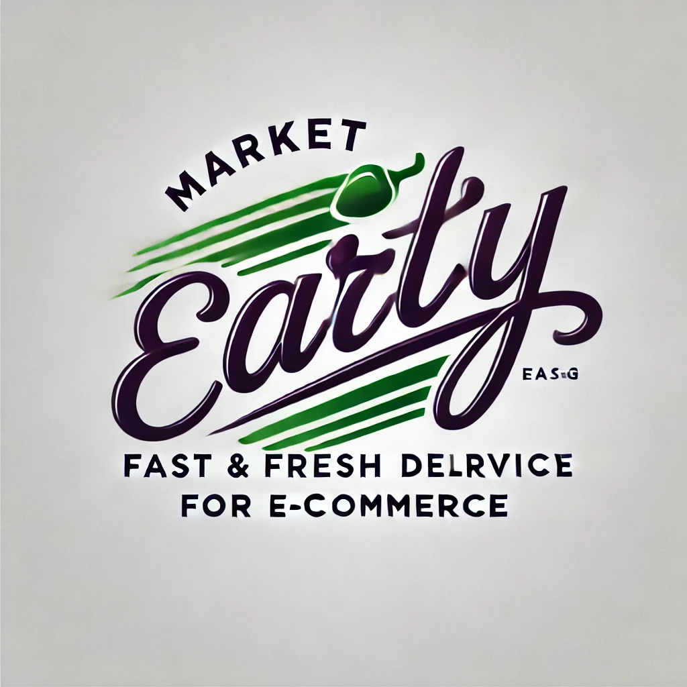
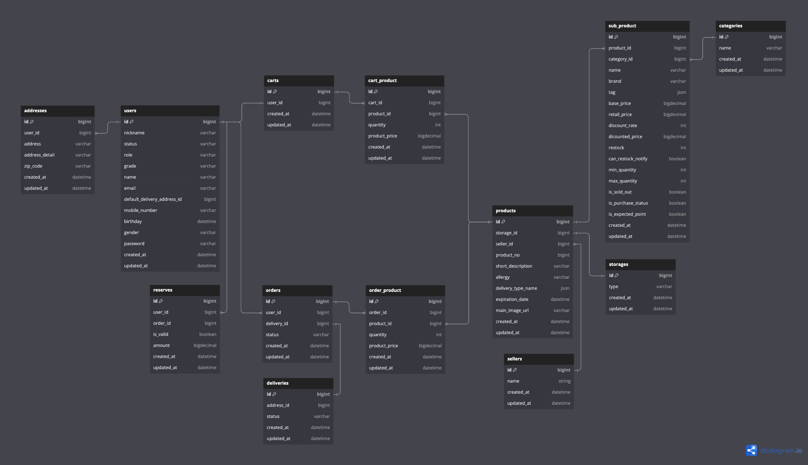
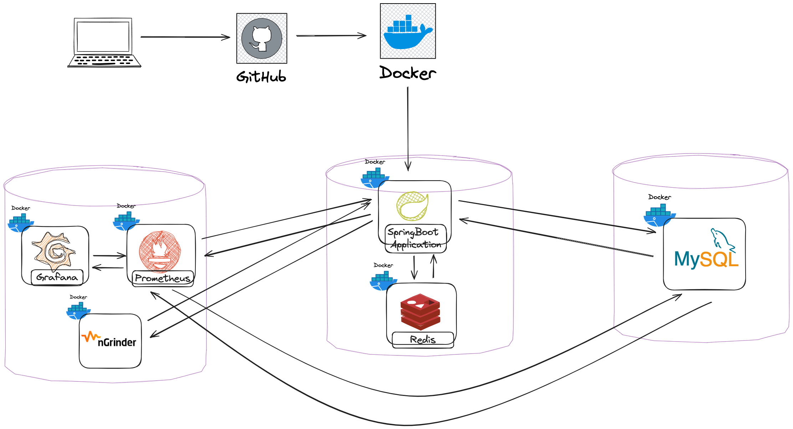

# Market Early

## 🛠️사용 기술 및 환경
* 백엔드: Spring Boot
* Database: Mysql, Redis
* Cloud: Naver Cloud Platform
* Monitoring:  Prometheus, Grafana
* ETC: Docker, Jenkins, nGrinder  

## 🙌 Market Early 서비스 소개
* 온라인 쇼핑몰인 Market Curly와 같은 e-commerce 서비스를 개발하는 프로젝트입니다.  
* 애플리케이션의 UI는 구현하지 않고 백엔드에 초점을 맞춰서 구현했습니다.
* 대용량 트래픽을 받는다는 가정하에 개발했으며 성능, 코드의 재사용성 및 유지보수성을 고려하여 개발했습니다.
---
🔖 DB 설계 (Mysql)
---

🔖 아키텍처
---

## 🤔 Technical Issue & Solution
* Toss 결제 API 통합 및 트랜잭션 관리
* Redis 캐시 적용으로 대량의 트래픽 발생시 p95, TPS, MTT performance 향상
* 대용량 데이터 처리를 위한 Mysql Indexing 및 Query Optimization
* 분산 서버 환경에서의 인증 관리

