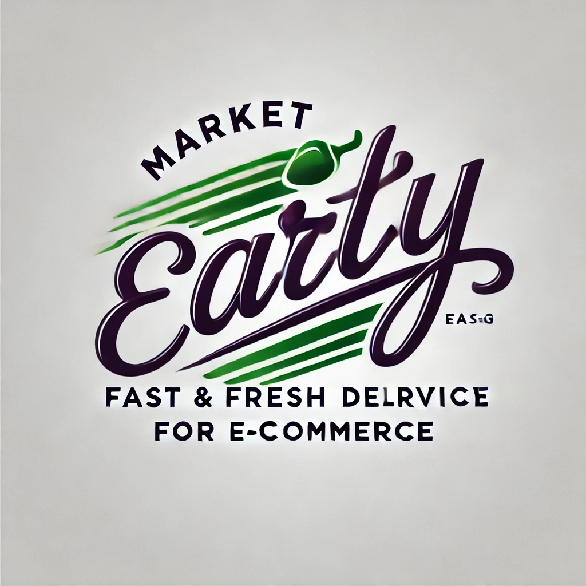
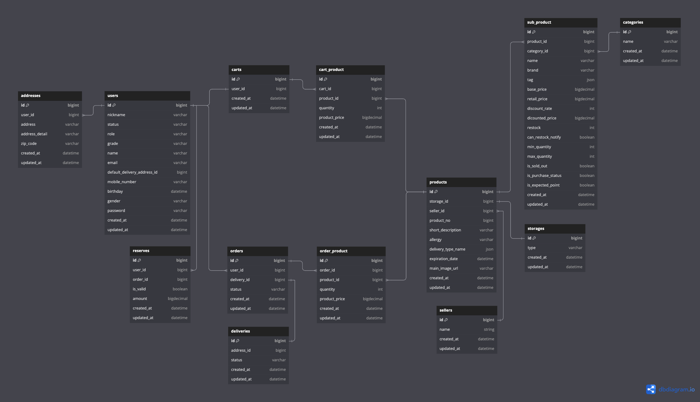
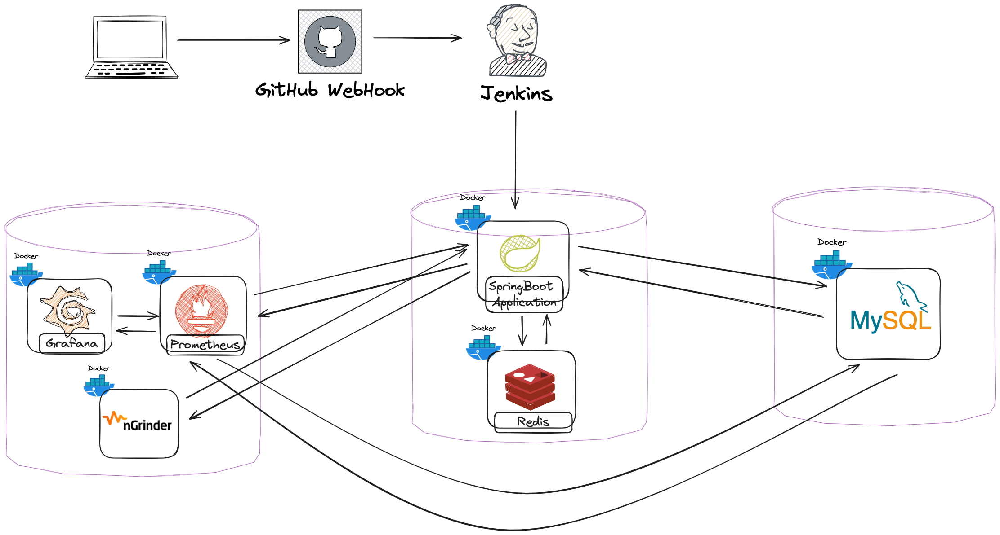

# Market Early

## 🛠️사용 기술 및 환경
* 백엔드: Spring Boot
* Database: Mysql, Redis
* Cloud: Naver Cloud Platform
* Monitoring:  Prometheus, Grafana
* ETC: Docker, Jenkins, nGrinder  

## 🙌 Market Early 서비스 소개
* 온라인 쇼핑몰인 Market Curly와 같은 e-commerce 서비스를 개발하는 프로젝트입니다.  
* 애플리케이션의 UI는 구현하지 않고 백엔드에 초점을 맞춰서 구현했습니다.
* 대용량 트래픽을 받는다는 가정하에 개발했으며 성능, 코드의 재사용성 및 유지보수성을 고려하여 개발했습니다.
---
🔖 DB 설계 (Mysql)
---

🔖 아키텍처
---

## 🤔 Technical Issue & Solution
* Toss 결제 API 통합 및 트랜잭션 관리
* Redis 캐시 적용으로 대량의 트래픽 발생시 p95, TPS, MTT performance 향상 => [Blog Link](https://medium.com/@digle117/ngrinder%EB%A1%9C-springboot-application-test%EC%8B%9C-%EA%B0%9C%EC%84%A0%ED%95%A0-%EB%A7%8E%EC%9D%80-%EC%9D%B4%EC%95%BC%EA%B8%B0-d5466405f8ab)
* 대용량 이미지 데이터 처리를 위해 퍼포먼스 향상을 위한 Naver Cloud Objet Storage 사용 => [Blog Link](https://medium.com/@digle117/%ED%9A%A8%EC%9C%A8%EC%A0%81%EC%9D%B8-e-commerce-%EC%9D%B4%EB%AF%B8%EC%A7%80-%EC%A0%80%EC%9E%A5%EC%9D%84-%EC%9C%84%ED%95%9C-naver-cloud-platform-object-storage-%ED%99%9C%EC%9A%A9%EA%B8%B0-8196591d63bf)
* 분산 서버 환경에서의 인증 관리를 위한 JWT Token 적용

